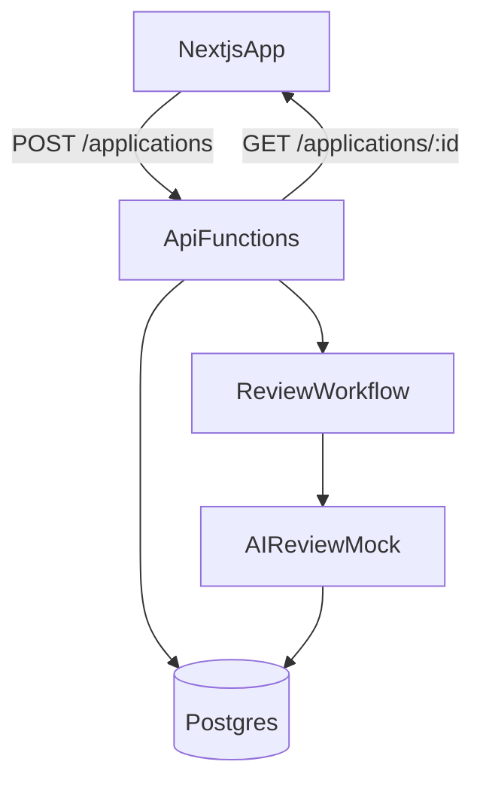

# Rentals Inc - AI-Orchestrated Leasing MVP

Minimal full-stack implementation of the leasing intake workflow. The UI is intentionally simple while the backend focuses on clear state transitions, auditability, and RBAC.

## Architecture overview
- **Frontend**: `apps/web` (Next.js App Router)
- **Backend**: `apps/api` (Vercel Functions + Prisma)
- **Database**: Postgres (local Docker for dev)
- **Workflow**: synchronous workflow runner modeled for Vercel Workflows
- **Infra**: `infra/` Terraform skeleton for Vercel project + env vars



## Setup (local)
1) Start Postgres:
```
docker run --name rentals-postgres -e POSTGRES_PASSWORD=postgres -e POSTGRES_USER=postgres -e POSTGRES_DB=rentals -p 5432:5432 -d postgres:16
```

2) Backend (API):
```
cd apps/api
npm install
npx prisma migrate dev --name init
cd ../..
vercel dev --cwd apps/api --listen 3001
```

3) Frontend (Web):
```
cd apps/web
npm install
npm run dev
```

Default URLs:
- Web: `http://localhost:3000`
- API: `http://localhost:3001`

## API endpoints
- `POST /api/applications`
  - Body: applicant metadata + mocked document metadata
  - Persists application and triggers review workflow
- `GET /api/applications/:id`
  - Returns current status, review result, and recent audit events

## Workflow description
1) `submitted` -> `under_review`
2) AI document analysis (mocked scoring + signals)
3) System decision policy updates status to `approved` or `flagged`
4) Audit events captured for each transition

## RBAC policy
- `applicant`: can submit; can view only matching applicant email
- `reviewer`: can view any application
- `admin`: can submit or view any application

Headers used:
- `X-User-Role`: `applicant | reviewer | admin`
- `X-Applicant-Email`: required for applicant access

## Assumptions & limitations
- Document upload is mocked via metadata only (filename, type, size).
- AI review uses deterministic heuristics for consistency.
- Workflow runs synchronously for demo; replace with Vercel Workflows in production.

## AI vs human review separation
AI outputs are stored in `ReviewResult`. Status changes are applied by system policy logic, not directly by AI output. Human reviewers can override by adding a new audit event (not implemented in UI).

## Part 3: Engineering reasoning

### 1) Scalability
At 10x volume, the state transitions and workflow steps remain linear but the bottleneck becomes document processing and database writes. I would introduce asynchronous workflow execution with Vercel Workflows, move document storage to blob/S3, and add read replicas for reporting. Key metrics: workflow duration, queue depth, DB write latency, and error rates by step.

### 2) Fraud & trust
Enhancements would include OCR provenance checks, image forensics (EXIF, tampering detection), cross-document consistency checks, and third-party verification (employment/payroll APIs). Automation should only raise signals; approvals should require either high-confidence thresholds or manual review for borderline cases.

### 3) System authority
AI outputs are persisted as suggestions, never authoritative. The system applies deterministic policy to update the canonical status and records the decision in an audit event. Human overrides should create explicit events rather than mutate AI output.

### 4) Operational readiness
Use step-level retries, idempotency keys per workflow, and structured logs with correlation IDs. Expose workflow run status and errors in an ops dashboard. Use alerting for repeated failures and DLQ for poisoned payloads.
